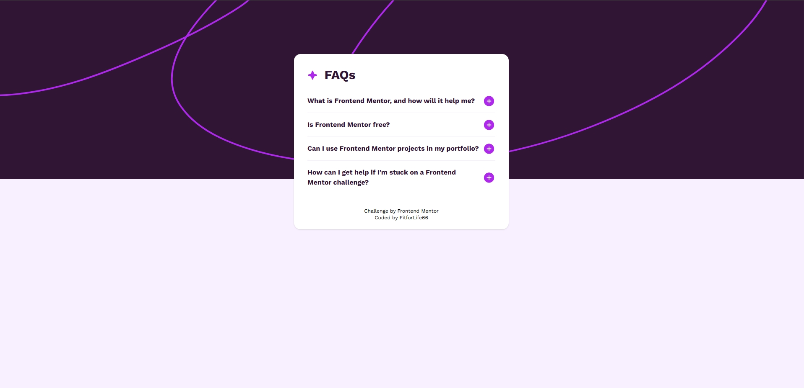

# Frontend Mentor – FAQ Accordion Card solution

This is a solution to the [FAQ accordion challenge on Frontend Mentor](https://www.frontendmentor.io/).  
Frontend Mentor challenges help you improve your coding skills by building realistic projects.

---

## Table of contents

- [Frontend Mentor – FAQ Accordion Card solution](#frontend-mentor--faq-accordion-card-solution)
  - [Table of contents](#table-of-contents)
  - [Overview](#overview)
    - [The challenge](#the-challenge)
    - [Screenshot](#screenshot)
    - [Links](#links)
  - [My process](#my-process)
    - [Built with](#built-with)
    - [What I learned](#what-i-learned)
      - [1. Controlling `<details>` with React state](#1-controlling-details-with-react-state)
      - [2. Using CSS custom properties from React/TypeScript](#2-using-css-custom-properties-from-reacttypescript)
      - [3. SVG icons as reusable components](#3-svg-icons-as-reusable-components)
      - [4. Flexbox and preventing icon shrinking](#4-flexbox-and-preventing-icon-shrinking)
    - [Useful resources](#useful-resources)
  - [Project setup](#project-setup)
    - [Getting started](#getting-started)
  - [Author](#author)

---

## Overview

### The challenge

Users should be able to:

- See a responsive FAQ card
- Expand and collapse individual questions
- See a plus/minus icon switch when toggling a question
- Have only the content below each summary expand/collapse, without layout glitches
- View the optimal layout depending on their device’s screen size

### Screenshot



### Links

- Solution URL: [GitHub](https://github.com/GBcode66//faq_accordion)
- Live Site URL: [GitHub.io](https://GBcode66.github.io/faq_accordion)

---

## My process

### Built with

- Semantic HTML5
- CSS custom properties (for colors and fonts)
- [Tailwind CSS](https://tailwindcss.com/) for utility-first styling
- [React](https://react.dev/) with [TypeScript](https://www.typescriptlang.org/)
- [Vite](https://vite.dev/) for fast dev/build tooling
- SVG icons as React components

### What I learned

#### 1. Controlling `<details>` with React state

Instead of relying on the native `<details>` toggle alone, each FAQ item is fully controlled by React:

```tsx
const [isVisible, setIsVisible] = useState(false)

return (
  <details open={isVisible}>
    <summary
      onClick={(e) => {
        e.preventDefault()      // prevent native toggle
        setIsVisible((prev) => !prev)
      }}
    >
      {/* ... */}
    </summary>
    <p>{faq.a}</p>
  </details>
)
```

Using `open={isVisible}` plus `preventDefault()` keeps React state and the DOM perfectly in sync.

#### 2. Using CSS custom properties from React/TypeScript

When using CSS variables in React, they must be passed as **strings**, so the browser can resolve them in CSS:

```ts
const iconStyles = {
  height: 31,
  fill: 'var(--color-purple-accent)',
}
```

This allows icons to follow the theme defined in `@theme`.

#### 3. SVG icons as reusable components

I created strongly-typed SVG icon components that accept props like `height` and `fill`:

```tsx
import type { SVGProps } from '../../types/types'

export default function PlusIcon({ height = 31, fill = '#AD28EB' }: SVGProps) {
  return (
    <svg
      xmlns="http://www.w3.org/2000/svg"
      height={height}
      fill="none"
      viewBox="0 0 30 31"
      aria-hidden="true"
    >
      <path
        fill={fill}
        d="M15 3.313A12.187 12.187 0 1 0 27.188 15.5 12.203 12.203 0 0 0 15 3.312Zm4.688 13.124h-3.75v3.75a.938.938 0 0 1-1.876 0v-3.75h-3.75a.938.938 0 0 1 0-1.875h3.75v-3.75a.938.938 0 0 1 1.876 0v3.75h3.75a.938.938 0 0 1 0 1.876Z"
      />
    </svg>
  )
}
```

This makes switching between plus and minus icons very straightforward in the FAQ component.

#### 4. Flexbox and preventing icon shrinking

Inside the FAQ header, text and icon are laid out with Flexbox. To avoid the icon being shrunk when the question text gets longer, I wrapped the icon in a non-shrinking container:

```tsx
<summary className="flex justify-between items-center gap-2 cursor-pointer">
  <p className="font-bold my-4">{faq.q}</p>
  <span className="flex-none">
    {isVisible ? (
      <MinusIcon {...iconStyles} fill="var(--color-purple-950)" />
    ) : (
      <PlusIcon {...iconStyles} />
    )}
  </span>
</summary>
```

`flex-none` guarantees a consistent icon size across all FAQ entries.

### Useful resources

- [MDN – `<details>` element](https://developer.mozilla.org/en-US/docs/Web/HTML/Element/details) – Great reference for the native behavior.
- [Tailwind CSS docs](https://tailwindcss.com/docs) – Great reference and very efficient with its search function.


---

## Project setup

This project uses the **React + TypeScript + Vite** template as a base.

### Getting started

1. Clone the repository:

   ```bash
   git clone https://github.com/GBcode66/faq-accordion.git
   cd faq-accordion
   ```

2. Install dependencies:

   ```bash
   npm install
   # or
   pnpm install
   ```

3. Start the development server:

   ```bash
   npm run dev
   ```

4. Build for production:

   ```bash
   npm run build
   ```

5. Preview the production build:

   ```bash
   npm run preview
   ```

---

## Author

- [Frontend Mentor](https://www.frontendmentor.io/profile/GBcode66)
- [GitHub](https://github.com/GBcode66/faq_accordion)
